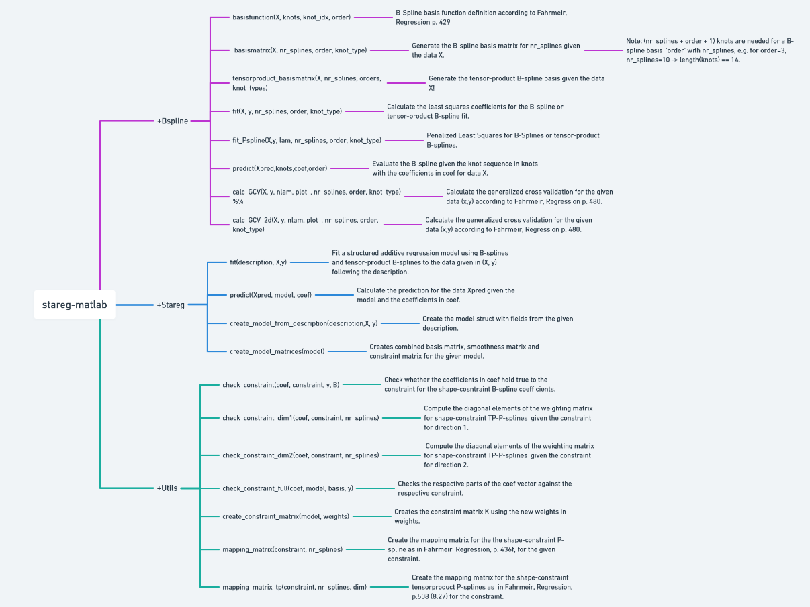

# stareg-matlab: STructured  Additive REGression in Matlab


## Usage

```Matlab
rng(2); % set random seed
n_data = 500; 
X = [rand(n_data,1), rand(n_data,2)]; % create input data
y = exp(-(X(:,1)-0.4).^2 ./ 0.01) + X(:,2).^2 + X(:,1).*X(:,2) + randn(n_data,1)*0.2; % create target data

Xtest = [rand(100,1), rand(100,1)]; % generate test data
ytest = exp(-(Xtest(:,1)-0.4).^2 ./ 0.01) + Xtest(:,2).^2 + Xtest(:,1).*Xtest(:,2)

d = {["s(1)", "peak", 100, 3000, "e"]; 
     ["t(1,2)", "none,inc", "12,20", "2000,2000", "e,q"]}; % create model description
     
[coef, basis_matrix, model] = Stareg.fit(d, X, y); % fit the model
ypred = Stareg.predict(Xtest, model, coef);

fprintf("MSE on test data = %4.4f \n", Utils.mse(ytest, ypred));
```
## Code Overview




## Features
- Structured Additive Regression
- B-Splines, P-Splines and shape-constraint P-splines
- Incorporate prior knowledge using constraints:
  - Monotonicity constraints: increasing, decreasing
  - Shape constraints: convex, concave
  - Peak and Valley constraints
- Interpretable Machine Learning
- Uni- and multivariate regression

## Support
If you are having issues, please let us know. Contact can be made via [GitHub](https://github.com/j-cap/stareg-matlab).

## License
The project is licensed under the MIT license.
